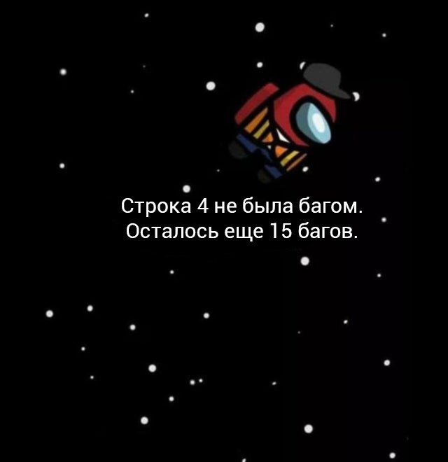
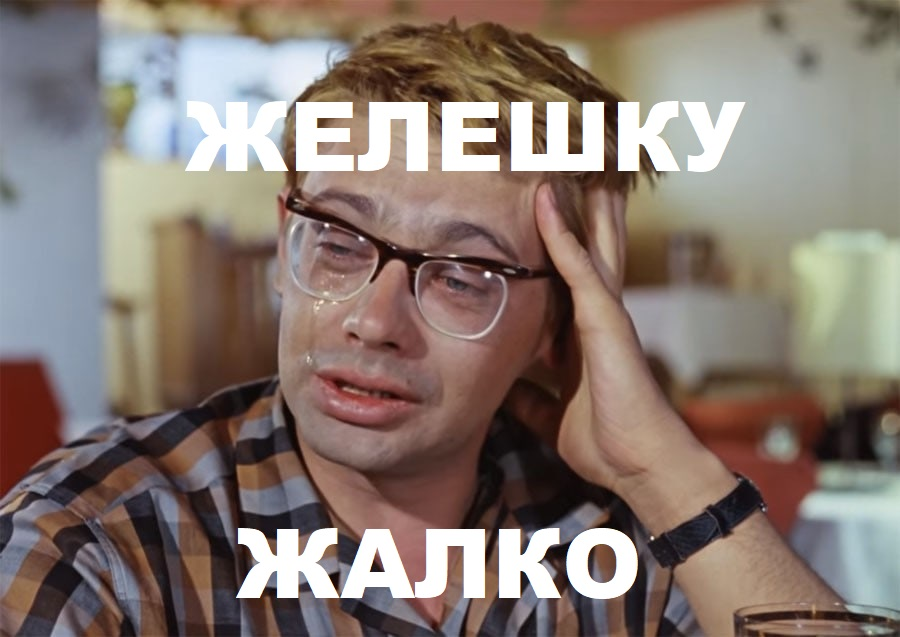

# Коротко о проблемах в процессе создания

### Технические проблемы
 

### Моральные проблемы
 
   
# Что сделано:
1. Выполнен уровень в проекте Aurora 
2. Реализовано движение игрока и ввод с клавиатуры, мыши или геймпада 
3. Реализована физическая модель движения (на основе встроенного физического модуля Arcade)
4. Реализована базовая модель поведения (стиринги Wander, Chase, RanawayFromObjects) 
5. Реализована модель поведения "верхнего уровня" для NPC (конечный автомат) 
6. Реализована процедурная генерация карты (RandomWalk + клеточный автомат) 
7. Реализовано заполнение уровня украшениями и врагами
    
# Development

```
cd phaser-test
npm install
npm start
```

# Build

```
cd phaser-test
npm run build
cd ./dist
```


